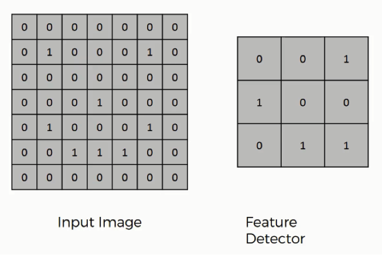

<h3>Convolution operation</h3> 

Convolution operation (tích chập) là một phương pháp được áp dụng trong nhiều bài toán thực tế . Trong Deep Learning, Convolution Operation được áp dụng trong mô hình Convolution Neural Network ,mô hình được ứng dụng rộng rãi trong computer vision hoặc natural language processing .

Hình dưới đây minh họa cho convolution operator 
 
 

Convolution operator bao gồm có 3 thành phần chính :

* Input Image: 
