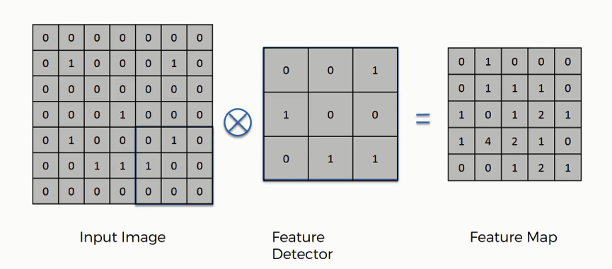
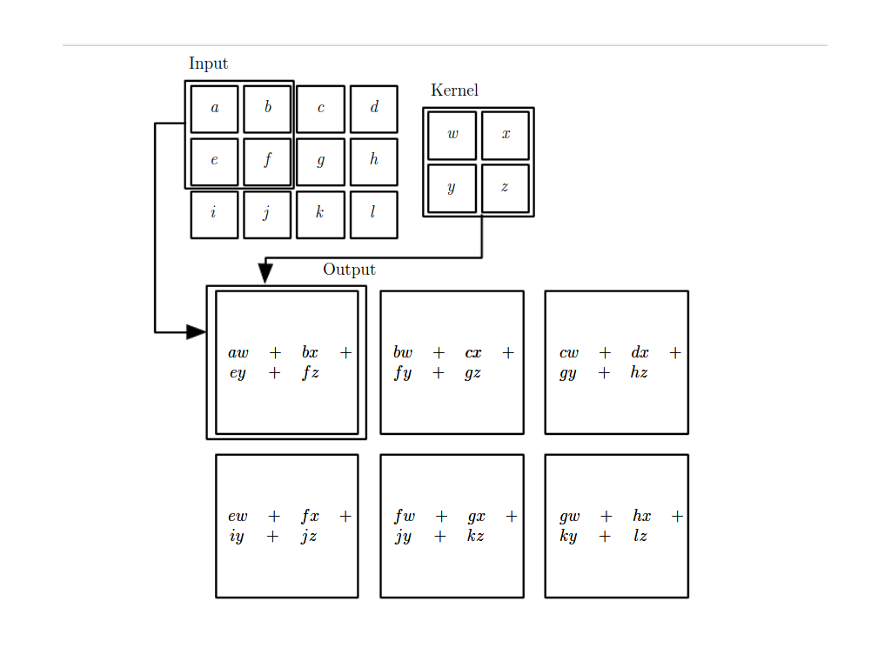

<h2>Convolution operation</h2> 

Convolution operation (tích chập) là một phương pháp được áp dụng trong nhiều bài toán thực tế . Trong Deep Learning, Convolution Operation được áp dụng trong mô hình Convolution Neural Network ,mô hình được ứng dụng rộng rãi trong computer vision hoặc natural language processing .

Hình dưới đây minh họa cho convolution operator trong lĩnh vực computer vision:
 
 

Convolution operator bao gồm có 3 thành phần chính :

* Input Image  
 
* Featrue Detector 

* Feature Map 

<h3>I. Input Image </h3> 

Là một multidimensional array (mảng đa chiều), đại diện cho đầu vào là một image.Image thường là những không gian màu như RGB , Grayscale , YUV ....

Input Image là một mảng 2 chiều chứa 2 số là 0 và 1 .

<h3>II.Feature detector</h3>
Hay còn được gọi là kernel hay filter cũng là một multidimensional array . Kernel giống như một cửa sổ trượt (sliding windows) dùng để quét hết tất cả các đặc trưng pixel trên ma trân input image bằng cách khi trượt tới ma trận con trên input image có cùng chiều thì thực hiện phép toán nhân ma trận vì thế những giá trị trên feature map là kết quả nhân ma trận của ma trân con cùng chiều của input image và kernel.

Để hiểu thêm về phương pháp trượt của kernel có thể xem ở hinh minh họa dưới đây :

<em> Nguồn: github.com/vdumoulin/conv_arithmetic</em> 

Input image là ma trận 4x4 màu xanh và kernel hay feature detector là ma trận 3x3 xanh đậm 

Sau khi trượt , kernel và ma trận con của input image sẽ thực hiện phép nhân 2 ma trận cùng chiều , xem hình minh họa dưới đây. 

 <em>Nguồn : deeplearningbook.org </em>

<h2>Convolution arthmetric</h2>
Ở phần trước , các minh họa về  convolution khi kernel trượt trên ma trận input image sẽ trượt qua 1 đơn vị hay từ trái sang phải trong tính chất convolution được gọi là <b>No Padding , No Strides</b>.

<h3>Padding và Stride </h3>
 
Stride là giá trị để  kernel trượt trên input image .Việc sử dụng stride trong convolution giúp cho ma trận feature map được giảm kích thước và bỏ qua những đặc trưng không quan trọng.

Ngược với stride , Padding là giá trị để tăng hoặc giữ lại các đặc trưng quan trọng của input image.Để có thể trả về feature map có kích thước như input image thì tạo viền xung quanh input image là các giá trị 0 .

<h4>No Padding , No Stride </h4>

Đây là trường hợp đơn giản khi thực hiện convolution :

<em>No Padding , No Stride</em>
 </p